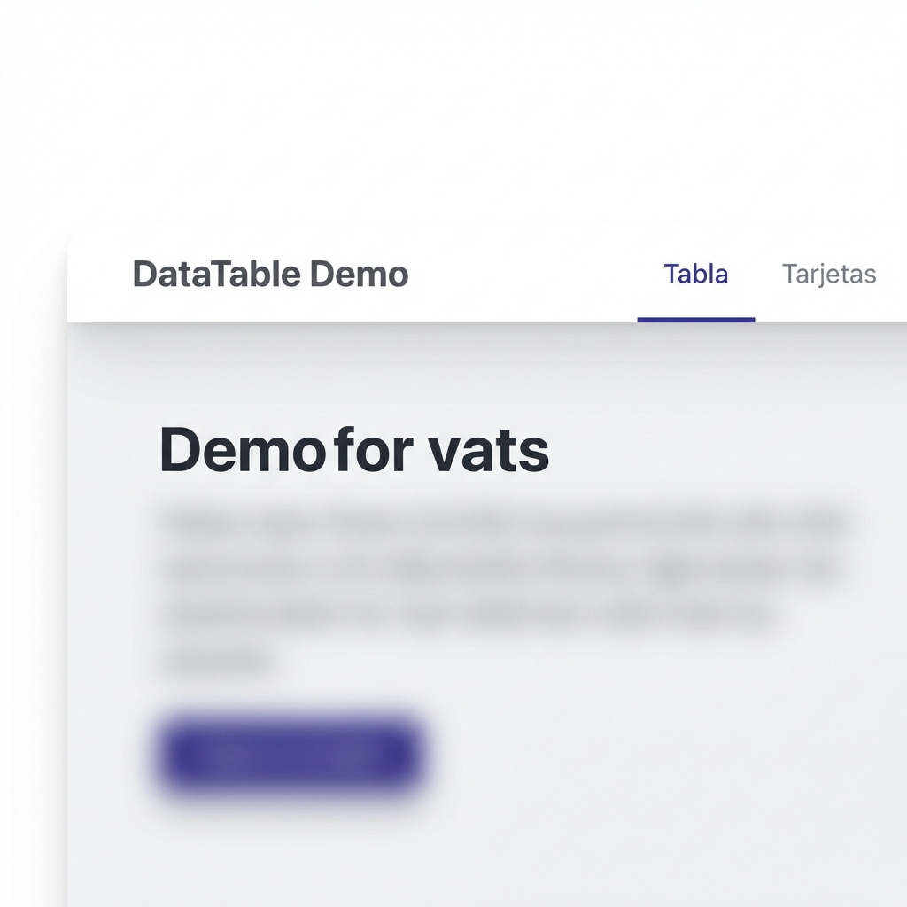
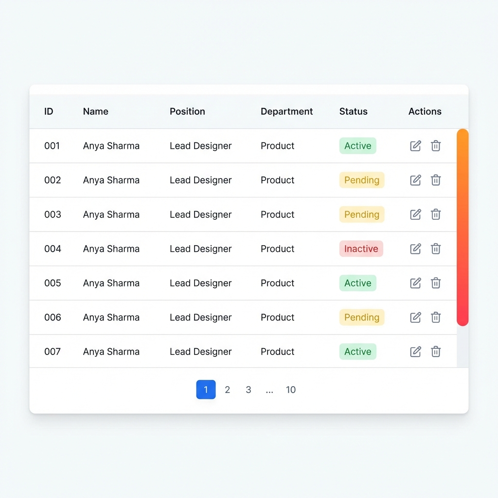

# DataTable Demo Project

Este proyecto es una demostración avanzada de componentes de tablas de datos (DataTables) construidos con **Vue 3**, **Vite** y **Tailwind CSS**. Incluye una arquitectura modular con componentes reutilizables, gestión de rutas y un diseño premium.

## 🚀 Características Principales

- **Componente DataTable Base**: Paginación inteligente, ordenamiento por columnas y filtrado reactivo.
- **Componente DataTable con Vista de Tarjetas**: Capacidad de alternar entre vista de tabla clásica y una cuadrícula de tarjetas (Cards).
- **Diseño Premium**: Interfaz moderna con sombras suaves, tipografía elegante y una barra de desplazamiento personalizada vibrante.
- **Rutas Dinámicas**: Navegación fluida entre diferentes ejemplos de implementación.
- **Personalización por Slots**: Control total sobre el renderizado de celdas, acciones y el diseño de las tarjetas.

---

## 📸 Vista Previa del Sistema

### Barra de Navegación
Permite alternar entre las diferentes vistas del proyecto de forma intuitiva.


### Vista de Tabla de Datos
Una tabla robusta con encabezados pegajosos (sticky) y desplazamiento horizontal para múltiples columnas.


### Vista de Tarjetas (Card View)
Una representación visual y moderna para dispositivos móviles o perfiles de usuario.


---

## 📂 Estructura del Proyecto

```text
src/
├── components/
│   ├── datatable.vue       # Componente base de tabla
│   └── datatableCard.vue   # Componente extendido con vista de tarjetas
├── views/
│   ├── datatable.vue       # Implementación básica (Route: /)
│   └── datatableCard.vue   # Implementación compleja con fotos (Route: /card)
├── router/
│   └── index.js            # Configuración de Vue Router
└── App.vue                 # Layout principal con navegación
```

---

## 🛠️ Configuración e Instalación

### Instalación de dependencias
```sh
npm install
```

### Ejecutar en modo desarrollo
```sh
npm run dev
```

### Construcción para producción
```sh
npm run build
```

---

## 📄 Notas de Implementación

- **Paginación**: Se implementó una lógica de paginación inteligente que muestra páginas intermedias y elipses (`...`) para manejar grandes conjuntos de datos de forma limpia.
- **Reactividad**: El filtrado (búsqueda) reinicia automáticamente la paginación para una mejor experiencia de usuario.
- **Estilos**: Se utilizó **Tailwind CSS v4** para un sistema de diseño rápido y consistente.
